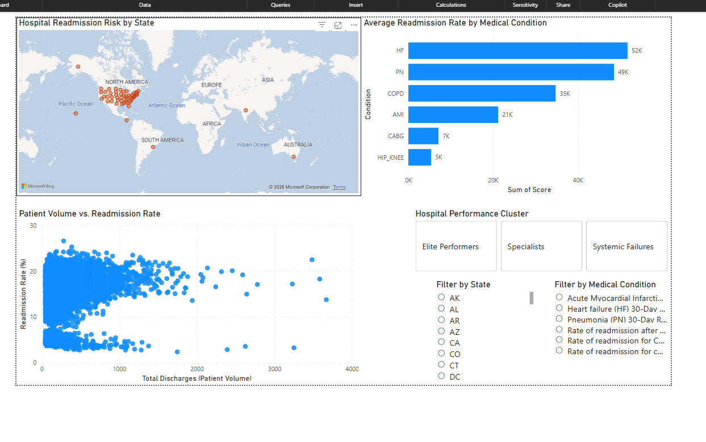
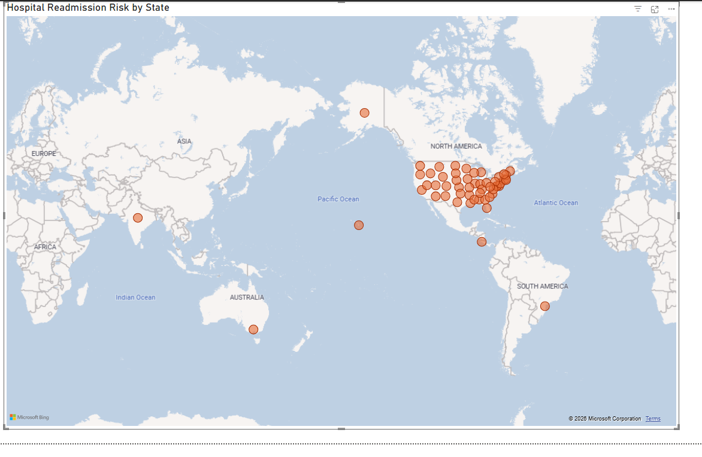
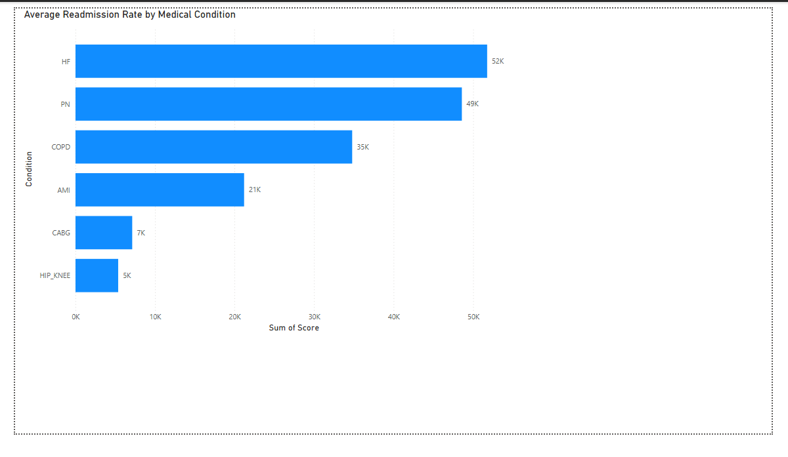
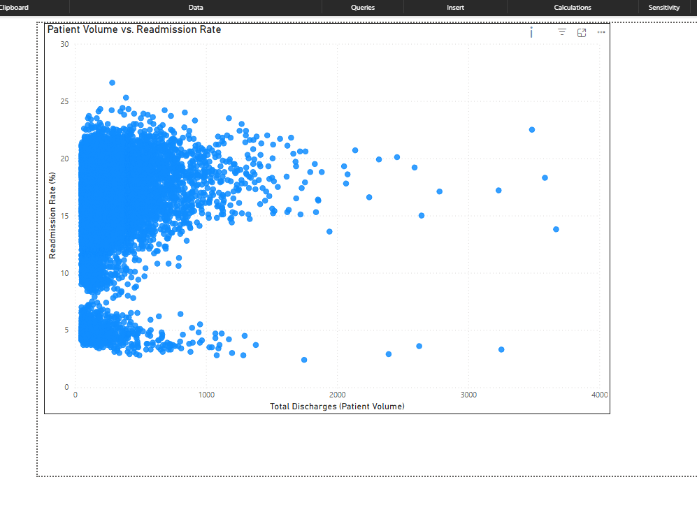
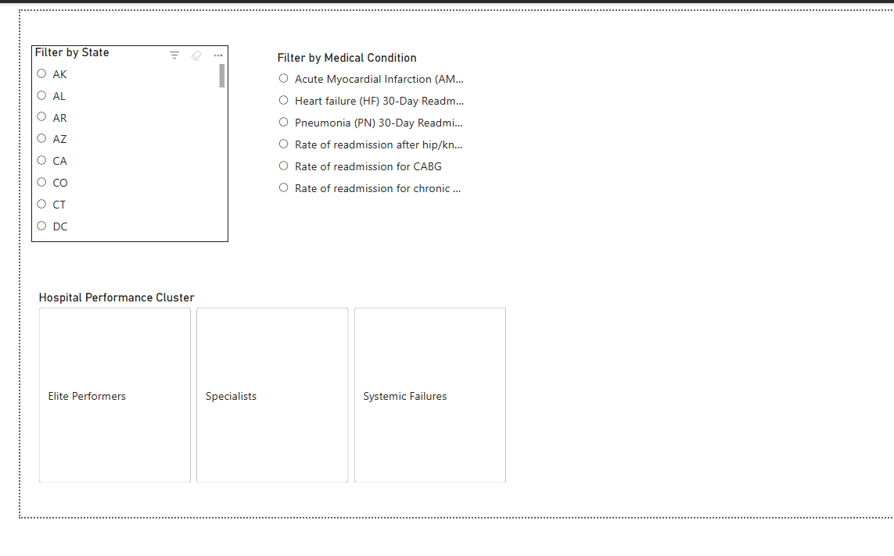

# Hospital Readmissions Data Cleaning Project

## Overview

This project provides a professional data cleaning pipeline for hospital readmissions data from the CMS Hospital Compare dataset. The script processes unplanned hospital visits data and filters it to focus on readmission measures.

### Project Status
-  **Data Cleaning Pipeline**: Automated cleaning and feature engineering
-  **SQL Business Analysis**: Queries for key performance insights  
-  **AI Clustering**: Hospital performance segmentation
-  **Power BI Dashboard**: Interactive visualization and AI insights
-  **Documentation**: Complete README with screenshots

## Files

- `Unplanned_Hospital_Visits-Hospital.csv` - Raw input data (CMS Hospital Compare)
- `clean_readmissions.py` - Professional data cleaning and clustering script
- `Cleaned_Readmission_Data.csv` - Output file with cleaned data and cluster labels (generated)
- `analysis_queries.sql` - SQL queries for business analysis
- `requirements.txt` - Python dependencies
- `Hospital_Readmissions_Dashboard.pbix` - Power BI dashboard file
- `power_bi/screenshots/` - Dashboard screenshots
- `README.md` - This documentation

## Requirements

- Python 3.7+
- pandas
- scikit-learn
- numpy

Install dependencies:
```bash
pip install -r requirements.txt
```

## Usage

Run the data cleaning script:
```bash
python3 clean_readmissions.py
```

## Data Cleaning Pipeline

The script performs the following operations:

1. **Load Data**: Reads the CSV file containing hospital visits data
2. **Filter Measures**: Keeps only rows where Measure ID starts with "READM" (readmission measures)
3. **Handle Missing Values**: Converts "Not Available" strings to NaN in numeric columns
4. **Drop Missing Data**: Removes rows where Score or Denominator is missing
5. **Feature Engineering**:
   - Creates `Readmission_Rate_Percentage` from the Score column
   - Creates `Number of Patients` from the Denominator column
   - Calculates `Number of Patients Returned` based on the rate
   - Creates `State_Region` column with cleaned state codes
   - Extracts `Condition` from Measure ID for clustering analysis
6. **Cluster Analysis**: Performs K-Means clustering to categorize hospitals into:
   - Elite Performers: Low readmissions across all categories
   - Specialists: Good at some conditions, bad at others
   - Systemic Failures: High readmissions everywhere
7. **Outlier Detection**: Filters out hospitals with fewer than 50 patients (low-volume facilities)
8. **Export**: Saves the cleaned data with cluster labels to `Cleaned_Readmission_Data.csv`
9. **Summary Statistics**: Displays first 5 rows and statistical summary

## Output Data

The cleaned dataset contains **10,909 records** with the following characteristics:

- **Measure Types**: 6 READM measure types (AMI, CABG, COPD, HF, HIP_KNEE, PN)
- **Readmission Rate Range**: 2.4% to 26.6% (mean: 15.48%)
- **Patient Volume**: All hospitals have ≥50 patients
- **No Missing Values**: All critical columns are complete

### Key Columns in Output

- `Facility ID`, `Facility Name`, `Address`, `City/Town`, `State`, `ZIP Code`
- `Measure ID`, `Measure Name` - Type of readmission being measured
- `Score` - Original readmission rate percentage
- `Denominator` - Number of eligible patients
- `Number of Patients` - Same as Denominator (for clarity)
- `Number of Patients Returned` - Calculated number of readmissions
- `Readmission_Rate_Percentage` - Final readmission rate
- `State_Region` - Cleaned state code
- `Condition` - Extracted condition (AMI, HF, PN, etc.) for analysis
- `Cluster_Label` - Hospital performance cluster (Elite Performers, Specialists, Systemic Failures)
- `Start Date`, `End Date` - Measurement period

## Power BI Dashboard

A comprehensive "Hospital Penalty Risk" dashboard has been created to visualize hospital readmissions data and provide actionable business insights.

### Dashboard Features

- **US State Map**: Color-coded by average readmission rates (red = high risk, green = low risk)
- **Medical Condition Analysis**: Bar chart comparing readmission rates across conditions (AMI, HF, PN, etc.)
- **Volume vs. Quality Analysis**: Scatter plot showing relationship between patient volume and readmission rates
- **Interactive Filters**: Slicers for State and Medical Condition filtering
- **Hospital Clustering**: Performance segmentation (Elite Performers, Specialists, Systemic Failures)

### Dashboard Screenshots

#### Overall Dashboard View


#### US State Risk Map


#### Medical Condition Comparison


#### Volume vs. Readmission Analysis


#### Interactive Filters


### Key Business Insights

1. **Geographic Risk Assessment**: States with highest readmission rates identified for targeted interventions
2. **Condition-Specific Performance**: Heart Failure shows highest readmission rates compared to other conditions
3. **Volume-Quality Relationship**: "Practice makes perfect" - higher volume hospitals demonstrate better outcomes
4. **AI-Driven Factors**: Automatic identification of key influencers on readmission rates
5. **Hospital Segmentation**: Clustering reveals performance patterns for strategic resource allocation

### Files

- `Hospital_Readmissions_Dashboard.pbix` - Power BI dashboard file (main project deliverable)
- `power_bi/screenshots/` - Dashboard screenshots for documentation
